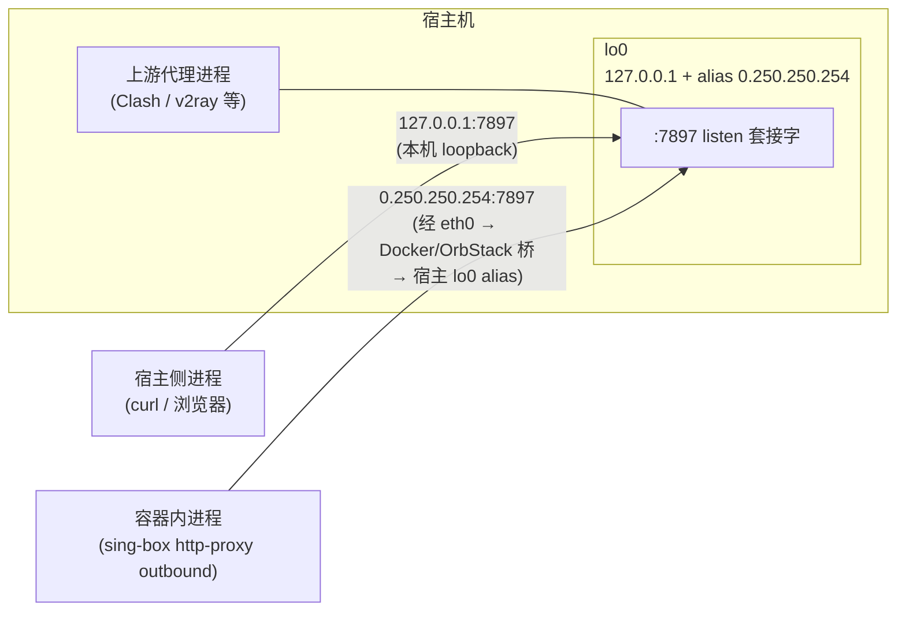
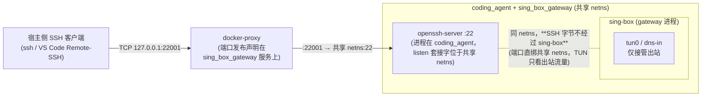
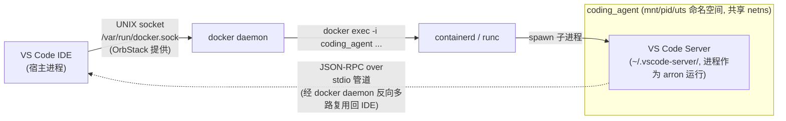
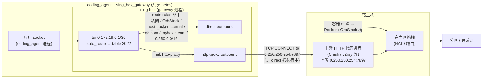
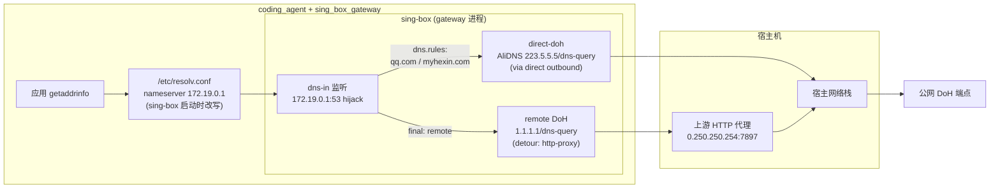

# 网络与代理

## 1. 目标

账号容器的公网出站流量通过 sing-box TUN 透明代理，宿主机、Docker/OrbStack 内部地址和局域网地址直连。应用进程不需要设置 `HTTP_PROXY`。

## 2. 网络模型

`coding_agent` 使用：

```yaml
network_mode: "service:sing_box_gateway"
```

由此 `coding_agent` 与 `sing_box_gateway` 共享 netns，且 Docker 把 gateway 的 `/etc/resolv.conf`、`/etc/hosts` bind-mount 进 coding_agent，DNS 视角等同。SSH 端口因此发布在 gateway：

```yaml
ports:
  - "127.0.0.1:${CODING_AGENT_SSH_PORT}:22"
```

### 2.1 角色定义

| 角色 | 位置 | 在数据流里的作用 |
|---|---|---|
| 应用 (Claude/Codex/Gemini/curl 等) | `coding_agent` 容器内 | 普通进程，不感知代理 |
| sing-box 进程 | `sing_box_gateway` 容器内 | 创建 `tun0`、监听 `dns-in:53`、按规则转发到 `direct` / `http-proxy` outbound |
| **上游 HTTP 代理**（Clash / v2ray / Mihomo 等） | **宿主机**用户进程，监听 `0.250.250.254:7897`（**位于宿主上**，不在任何容器里） | sing-box `http-proxy` outbound 的转发目标；真正发起公网连接的人 |
| 宿主网络栈 | 宿主机内核 | NAT / 路由到公网或局域网 |

### 2.2 `0.250.250.254` 是什么地址

- 它**不是公网地址**（落在 IETF 保留的 `0.0.0.0/8` 内，公网不可达）。
- 也**不是 OrbStack/Docker 默认分配**的桥地址（OrbStack 默认走 `198.19.x.x` / `host.docker.internal`）。
- 它是**宿主上由用户预先建立的一条本地路由别名**（macOS 上常见做法：`sudo ifconfig lo0 alias 0.250.250.254/32`，或 OrbStack/PF 规则把 `0.250.0.0/16` 映射到 lo），让宿主上的代理监听口对容器侧呈现为一个**稳定数字地址**。建立机制在本仓库范围外，由宿主侧脚本一次性配置。
- 仓库里有两处与此呼应：
  - sing-box `route_exclude_address` 与 `route.rules.ip_cidr` 都列入 `0.250.0.0/16` → 通向上游代理的连接**不被 TUN 再次接管**（否则会形成劫持死循环）
  - `scripts/proxy.env` 在宿主无 sing-box 的环境里把 `HTTP_PROXY=http://0.250.250.254:7897` 直接交给应用使用
- `host.docker.internal` 是等价的替代路径，但本仓库选用固定数字地址以避免再触发一次 DNS 解析。

### 2.3 `0.250.250.254:7897` 与 `127.0.0.1:7897` 的关系

**同一个代理进程上的同一个 listen 套接字**，只是从不同位置访问时使用不同名字：



| 调用方位置 | 用哪个地址 | 原因 |
|---|---|---|
| 宿主进程 | `127.0.0.1:7897` | loopback 直达，最快 |
| 容器进程 | `0.250.250.254:7897` | 容器内 `127.0.0.1` 指向**容器自己**的 loopback，无法到宿主；必须用宿主上配的 lo0 alias 才能落回同一 socket |

因此 `scripts/proxy.env` 始终用 `0.250.250.254:7897`（容器/宿主两端都可达），而 sing-box `http-proxy` outbound 也用同一字面值；两者最终命中宿主上的同一进程。

### 2.4 入站数据流 A：SSH（VS Code Remote-SSH / 终端 ssh）



**为什么不经过 sing-box**：TUN 的作用是把"由应用发起、目的不在 `route_exclude_address` 的出站包"按 `ip rule` 转到 `tun0`。SSH 入站包是从外部 *到达* netns 的 22 端口，不命中任何路由规则，由内核直接派发给 listen 套接字（sshd）。sing-box 进程也在同一 netns，但它**只读 tun0 设备**，看不到这些入站包。

### 2.5 入站数据流 B：VS Code Dev Containers（Attach to Running Container）

VS Code 的 "Dev Containers: Attach to Running Container..." **不走网络**，而是通过 Docker 守护进程的 UNIX 套接字执行 `docker exec`：



注意：

- 整条路径是**进程管理 + UNIX 套接字 + stdio 管道**，**完全不进入宿主 TCP/IP 栈，也不进入 sing-box**。
- VS Code Server 在容器内**自身发起**的网络请求（拉取插件、Language Server 联网等）才会进入 sing-box —— 此时走"出站数据流"路径。
- Remote-SSH 走 SSH（路径 A），Attach to Running Container 走 docker exec（路径 B）。本仓库推荐路径 B（见 `02-setup-and-operations.md`）。

### 2.6 出站数据流



### 2.7 DNS 数据流



注意：`protocol: dns` 嗅探规则在当前 `tun-in` 未开启 `sniff` 时不生效。劫持只靠 `dns-in` 入站；硬编码 `dig @8.8.8.8` 会经 tun0 但不被识别为 DNS，按普通 UDP 交给 http-proxy 后超时。

## 3. 配置位置

Compose 变量：

```text
coding_agent_env/compose/coding-agent/coding-agent.env
```

sing-box 运行配置（容器内挂载到 `/etc/sing-box/config.json`）：

```text
$CODING_AGENT_SING_BOX_CONFIG_DIR/config.json
```

`CODING_AGENT_SING_BOX_CONFIG_DIR` 必须在 `coding-agent.env` 中设置（compose 无默认值）。仓库跟踪的示例配置：

```text
scripts/sing-box/config.json
```

`coding-agent.env` 默认把 `CODING_AGENT_SING_BOX_CONFIG_DIR` 指向该路径，因此首启即可用。**上游代理地址写在 sing-box config.json 的 `http-proxy` outbound 内（不再经 compose env 传入 gateway）**。

宿主侧 Agent executable shim 通过 `scripts/proxy.env` 适配网络环境：宿主机上未安装 sing-box 时设置 `HTTP_PROXY`/`HTTPS_PROXY`；安装了 sing-box 时改用 `CODING_AGENT_UPSTREAM_PROXY_*` 变量。这些变量**只在宿主侧消费**，不再传入容器（容器内 sing-box 通过自身 config 拿到代理地址）。`scripts/proxy.env` 不应存放账号 token 或认证密钥。

## 4. DNS 与 IPv4

sing-box 启动时（`stack: system + auto_route: true`）会改写 gateway 容器的 `/etc/resolv.conf` 为 `nameserver 172.19.0.1`；该文件经 Docker `network_mode: service:` 自动 bind-mount 到 coding_agent，两个容器共享同一份。容器内任何 `getaddrinfo` 都会命中 `172.19.0.1:53`，由 sing-box `dns-in` 入站 hijack 后按 `dns.rules` 分流。最终配置使用 `ipv4_only`，避免 fake IPv6 或不可达 IPv6 地址导致连接失败。

`compose` 里 `sing_box_gateway.dns` 字段当前**不存在**（已删除）：它本就不会进入运行时 resolv.conf，sing-box 启动覆盖在前。

## 5. 最终可用配置结论

当前已验证的透明代理路径使用 HTTP upstream proxy，而不是 SOCKS upstream proxy。原因是 DNS 需要通过代理出口解析并保持连接目标与出口可达性一致；历史调试中 SOCKS UDP 路径无法稳定承载 DNS。

关键配置：

- TUN MTU 使用 `1280`。
- DNS 全部使用 DoH：`remote`（默认）经 HTTP proxy 出口，`direct-doh`（`qq.com` / `myhexin.com` 等）走 direct 出口。
- `/etc/resolv.conf` 由 sing-box 改写为 `172.19.0.1`。
- 本地、私网、OrbStack 宿主机地址走 direct。

## 6. 验证命令

容器内执行：

```bash
nslookup www.google.com
curl -v --max-time 10 https://www.google.com
curl -s --max-time 5 https://github.com -o /dev/null -w "HTTP: %{http_code}, Time: %{time_total}s\n"
```

预期 DNS server 为 `172.19.0.1`，HTTPS 请求不需要显式 `--proxy` 或 `--socks5-hostname`。
